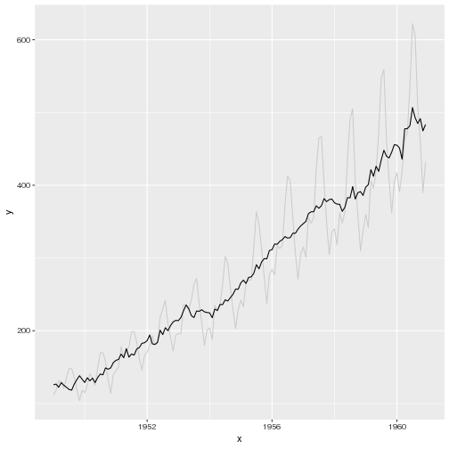
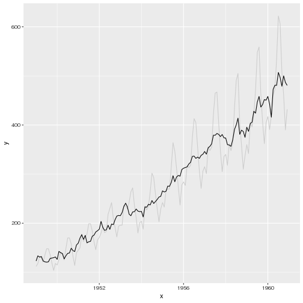
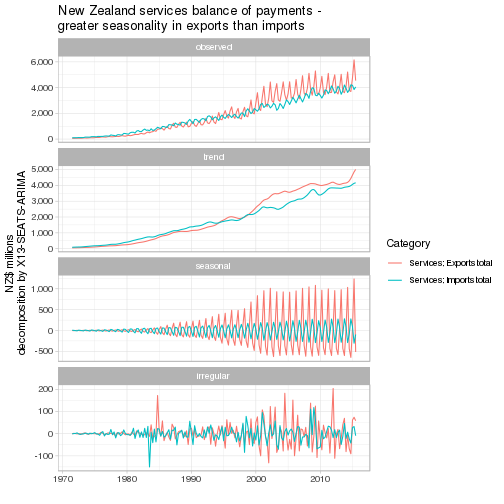

# ggseas R package
seasonal adjustment on the fly extension for ggplot2

Convenience functions that let you easily do seasonal adjustment on the fly with ggplot.

Depends on the [`seasonal` package](https://cran.r-project.org/web/packages/seasonal/index.html) to give you access to X13-SEATS-ARIMA.

[](https://travis-ci.org/ellisp/ggseas)
[](http://www.r-pkg.org/pkg/ggseas)
[](http://www.r-pkg.org/pkg/ggseas)


## Installation
Install the stable version the usual way from CRAN:


```r
install.packages("ggseas")
```


or the latest version (bugs and all) from GitHub:

```r
devtools::install_github("ellisp/ggseas/pkg")
```


## Usage - seasonal adjustment on the fly
So far there are three types of seasonal adjustment possible to be incorporated
into a usual ggplot() command, substituting for where you'd normally have geom_line().

### X13-SEATS-ARIMA

```r
library(ggseas)
```

```
## Loading required package: seasonal
```

```
## Loading required package: ggplot2
```

```
## Loading required package: zoo
```

```
## 
## Attaching package: 'zoo'
```

```
## The following objects are masked from 'package:base':
## 
##     as.Date, as.Date.numeric
```

```r
# make demo data with the convenience "time series to data.frame" function tsdf()
ap_df <- tsdf(AirPassengers)

# SEATS with defaults
ggplot(ap_df, aes(x = x, y = y)) +
   geom_line(colour = "grey80") +
   stat_seas() +
   ggtitle("SEATS seasonal adjustment - international airline passengers") +
   ylab("International airline passengers per month")
```

```
## Calculating starting date of 1949 from the data.
```

```
## Calculating frequency of 12 from the data.
```


```r
# X11 with no outlier treatment
ggplot(ap_df, aes(x = x, y = y)) +
   geom_line(colour = "grey80") +
   stat_seas(x13_params = list(x11 = "", outlier = NULL)) +
   ggtitle("X11 seasonal adjustment - international airline passengers") +
   ylab("International airline passengers per month")
```

```
## Calculating starting date of 1949 from the data.
## Calculating frequency of 12 from the data.
```


```r
ggplot(ldeaths_df, aes(x = YearMon, y = deaths, colour = sex)) +
   geom_point(colour = "grey50") +
   geom_line(colour = "grey50") +
   facet_wrap(~sex) +
   stat_seas(size = 2) +
   ggtitle("Seasonally adjusted lung deaths in the UK 1974 - 1979") +
   ylab("Deaths") +
   xlab("(light grey shows original data;\ncoloured line is seasonally adjusted)") +
   theme(legend.position = "none")
```

```
## Calculating starting date of 1974 from the data.
## Calculating frequency of 12 from the data.
```

```
## Calculating starting date of 1974 from the data.
```

```
## Calculating frequency of 12 from the data.
```


### STL (LOESS-based decomposition)

```r
# periodic if fixed seasonality; doesn't work well:
ggplot(ap_df, aes(x = x, y = y)) +
   geom_line(colour = "grey80") +
   stat_stl(s.window = "periodic")
```

```
## Calculating frequency of 12 from the data.
```


```r
# seasonality varies a bit over time, works better:
ggplot(ap_df, aes(x = x, y = y)) +
   geom_line(colour = "grey80") +
   stat_stl(s.window = 7)
```

```
## Calculating frequency of 12 from the data.
```



### Classical decomposition

```r
# default additive decomposition (doesn't work well in this case!):
ggplot(ap_df, aes(x = x, y = y)) +
   geom_line(colour = "grey80") +
   stat_decomp()
```

```
## Calculating frequency of 12 from the data.
```


```r
# multiplicative decomposition, more appropriate:
ggplot(ap_df, aes(x = x, y = y)) +
   geom_line(colour = "grey80") +
   stat_decomp(type = "multiplicative")
```

```
## Calculating frequency of 12 from the data.
```



## Usage - seasonal decomposition on the fly
From version 0.2.0 I introduce a summary graphic decomposition, similar to what
you'd get with plot(stats::decompose(x)), but in the ggplot2 environment.  As well
as allowing ggplot2 look and feel of plots, you can also map a variable to the 
colour (or color) aesthetic, to allow two difference decompositions on the same
graphic.

```r
ggsdc(ap_df, aes(x = x, y = y), method = "decompose") +
   geom_line()
```

```
## Calculating frequency of 12 from the data.
```

```
## Warning: Removed 6 rows containing missing values (geom_path).
```


```r
ggsdc(ap_df, aes(x = x, y = y), method = "stl", s.window = 7) +
   labs(x = "", y = "Air passenger numbers") +
   geom_point()
```

```
## Calculating frequency of 12 from the data.
```


```r
ggsdc(ldeaths_df, aes(x = YearMon, y = deaths, colour = sex), method = "seas") +
      geom_line()
```

```
## Calculating starting date of 1974 from the data.
## Calculating frequency of 12 from the data.
```

```
## Calculating starting date of 1974 from the data.
```

```
## Calculating frequency of 12 from the data.
```


```r
library(scales) # for label= comma
serv <- subset(nzbop, Account == "Current account" & 
                  Category %in% c("Services; Exports total", "Services; Imports total"))

ggsdc(serv, aes(x = TimePeriod, y = Value, colour = Category),
      method = "seas", start = c(1971, 2), frequency = 4) +
   geom_line() +
   scale_y_continuous("NZ$ millions\ndecomposition by X13-SEATS-ARIMA", label = comma) +
   labs(x = "") +
   ggtitle("New Zealand services balance of payments -\ngreater seasonality in exports than imports") +
   theme_light()
```



