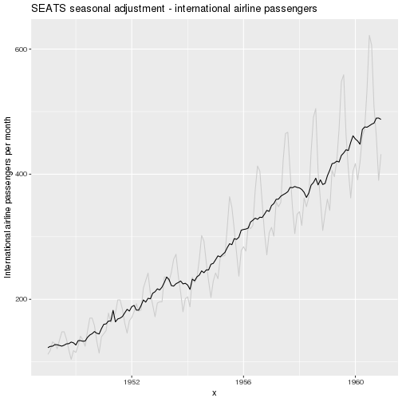
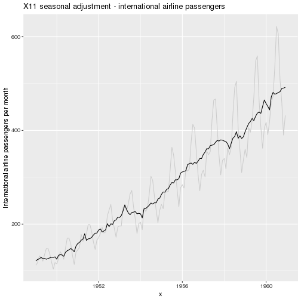

# ggseas R package
seasonal adjustment on the fly extension for ggplot2

Convenience functions that let you easily do seasonal adjustment on the fly with ggplot.

Depends on the [`seasonal` package](https://cran.r-project.org/web/packages/seasonal/index.html) to give you access to X13-SEATS-ARIMA.

## Installation
Currently only available via this GitHub repository although I might tidy it up for CRAN.  Install the usual way:


```r
devtools::install_github("ellisp/ggseas/pkg")
```


## Usage
So far there are three types of seasonal adjustment possible

### X13-SEATS-ARIMA

```r
library(ggseas)
# make demo data
ap_df <- data.frame(
   x = as.numeric(time(AirPassengers)),
   y = as.numeric(AirPassengers)
)

# SEATS with defaults
ggplot(ap_df, aes(x = x, y = y)) +
   geom_line(colour = "grey80") +
   stat_seas(start = c(1949, 1), frequency = 12) +
   ggtitle("SEATS seasonal adjustment - international airline passengers") +
   ylab("International airline passengers per month")
```


```r
# X11 with no outlier treatment
ggplot(ap_df, aes(x = x, y = y)) +
   geom_line(colour = "grey80") +
   stat_seas(start = c(1949, 1), frequency = 12, x13_params = list(x11 = "", outlier = NULL)) +
   ggtitle("X11 seasonal adjustment - international airline passengers") +
   ylab("International airline passengers per month")
```


```r
ggplot(ldeaths_df, aes(x = YearMon, y = deaths, colour = sex)) +
   geom_point(colour = "grey50") +
   geom_line(colour = "grey50") +
   facet_wrap(~sex) +
   stat_seas(start = c(1974, 1), frequency = 12, size = 2) +
   ggtitle("Seasonally adjusted lung deaths in the UK 1974 - 1979") +
   ylab("Deaths") +
   xlab("(light grey shows original data;\ncoloured line is seasonally adjusted)") +
   theme(legend.position = "none")
```


### STL (LOESS-based decomposition)

```r
# periodic if fixed seasonality; doesn't work well:
ggplot(ap_df, aes(x = x, y = y)) +
   geom_line(colour = "grey80") +
   stat_stl(frequency = 12, s.window = "periodic")
```



```r
# seasonality varies a bit over time, works better:
ggplot(ap_df, aes(x = x, y = y)) +
   geom_line(colour = "grey80") +
   stat_stl(frequency = 12, s.window = 7)
```



### Classical decomposition

```r
# default additive decomposition (doesn't work well in this case!):
ggplot(ap_df, aes(x = x, y = y)) +
   geom_line(colour = "grey80") +
   stat_decomp(frequency = 12)
```


```r
# multiplicative decomposition, more appropriate:
ggplot(ap_df, aes(x = x, y = y)) +
   geom_line(colour = "grey80") +
   stat_decomp(frequency = 12, type = "multiplicative")
```


